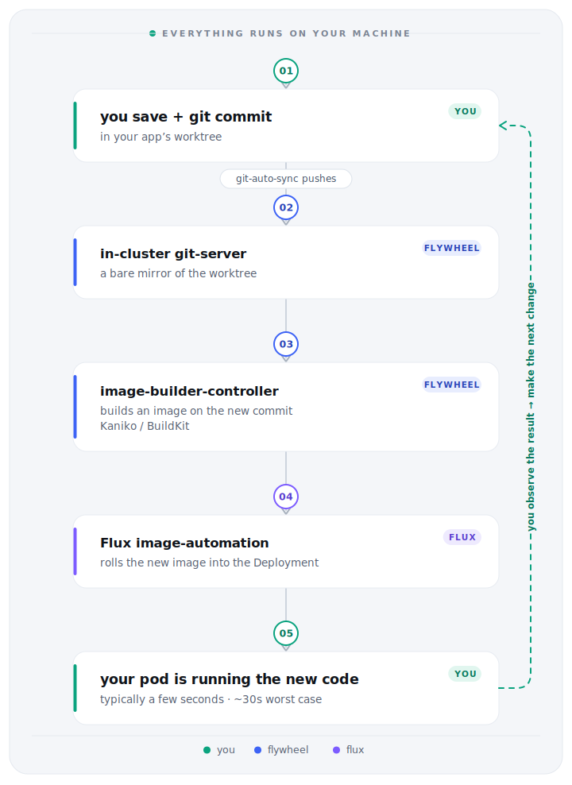
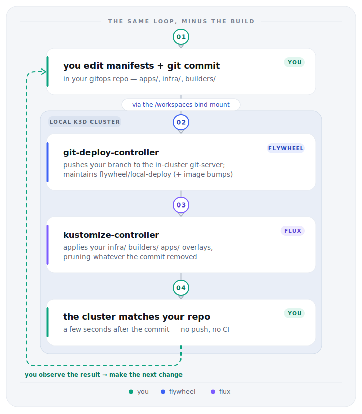

# Flywheel

**A single-binary CLI for a production-faithful local GitOps dev loop — `git
commit` lands in a running pod on a real Flux-driven k3d cluster in seconds.**

[](https://github.com/cobr-io/flywheel/actions/workflows/test.yml)
[](https://github.com/cobr-io/flywheel/releases)
[](LICENSE)

> **Status:** pre-1.0, under active development.

Flywheel gives you a local Kubernetes environment running the same GitOps
control plane you'd run in production: [Flux](https://fluxcd.io) reconciling
Kustomize overlays, [SOPS](https://github.com/getsops/sops)-encrypted secrets,
Traefik ingress with TLS. On top of that it wires a fast inner loop, so a
`git commit` becomes a running pod in seconds with no CI or external registry
in the path. The `base/` + `overlays/` layout Flux reconciles on your laptop
is the same one that promotes to a real cluster, so what works locally works
in real Flux.

The CLI is a single static Go binary that embeds the Flux manifests and the
GitOps-repo skeleton. Four runtime images on `ghcr.io/cobr-io/` provide the
dev-loop machinery, pinned by the version in your `flywheel.yaml`; bump that
line and re-run `flywheel up` to roll the whole loop forward.

## The dev loop

After `flywheel add app <dir>`, every commit flows to a pod entirely on your
machine:

<picture>
  <source media="(prefers-color-scheme: dark)" srcset="docs/assets/devloop-dark.svg">
  
</picture>

The cluster converges the same way Flux would converge production from a git
push; only the image build happens in-cluster instead of in your CI.

**What speed to expect:** a warm edit→served cycle — commit, in-cluster image
rebuild, deploy, new pod serving — is **~10 seconds** (measured 7–13s in CI and
locally). The very first bump after `add app` can take up to ~40s about half
the time ([#107](https://github.com/cobr-io/flywheel/issues/107)); a fresh
`flywheel up` is minutes, not seconds. If your loop is slower than this,
something is wrong — see
[docs/dev/dev-loop-latency.md](docs/dev/dev-loop-latency.md) for the per-hop
budget and how to find the stall.

### The same loop for your manifests

The gitops repo itself iterates the same way: edit `apps/`, `infra/`, or
`builders/`, commit, and the cluster converges in seconds — deletes included
(Flux prunes). Image bumps from the app loop land on a machinery-owned deploy
branch (`flywheel/local-deploy`), never on yours, so your branch history stays
clean. Details in [The gitops-repo loop](docs/guides/gitops-loop.md).

<picture>
  <source media="(prefers-color-scheme: dark)" srcset="docs/assets/gitopsloop-dark.svg">
  
</picture>

## What matches production

| Concern | Locally (Flywheel) | In production |
|---|---|---|
| Reconciliation | Flux pull-based GitOps | same — Flux |
| Manifests | Kustomize `base/` + `overlays/local` | same base, `overlays/prod` |
| Secrets | SOPS + age | same — SOPS + age |
| Ingress / TLS | Traefik + mkcert | Traefik / your ingress + real certs |
| Image rollout | Flux image-automation | same — Flux image-automation |
| Image source | in-cluster build (git-server + builder) | your CI → registry |

The local-only pieces are the inner-loop machinery: the in-cluster git-server,
the git-auto-sync sidecar, and in-cluster image builds. Those drop away when
you promote to a real cluster where images come from CI; see
[Promoting to production](docs/designs/2026-06-04-prod-promotion-feasibility.md).

### Tradeoffs

- You run a real cluster locally (k3d + Flux + a registry, via the docker
  daemon). That buys fidelity, and costs more memory and CPU than a
  docker-compose shim.
- The image path is the one thing that differs from production: local images
  are built in-cluster from your worktree, production images come from your CI.
- The workspace layout is opinionated: your gitops repo and app repos must be
  siblings under one `workspaces_root`, kept under `$HOME` (see
  [Gotchas](#gotchas)).
- The local SOPS age key is committed to the repo on purpose, so a teammate
  can clone and `up` with no key handoff. Treat `clusters/local` secrets as
  non-secret ([why this is safe](docs/guides/onboarding.md)).
- Flywheel manages one local environment. Promotion to staging or production
  is a manual flow, not a command.

## Quickstart

Prerequisites: `git`, `k3d`, the `docker` CLI + daemon, and `mkcert`. Run
`flywheel doctor` to check them.

```sh
# 1. Install the CLI (prebuilt binary)
curl -sSL https://raw.githubusercontent.com/cobr-io/flywheel/main/install.sh | bash

# 2. Scaffold and launch a local GitOps environment
mkdir my-gitops && cd my-gitops
flywheel init            # scaffold the GitOps repo in-place
flywheel up              # bring up k3d + Flux, pull runtime images

# 3. Wire up an app with a live dev loop
flywheel add app <dir>   # scaffold a builder + workload from a worktree dir
```

`flywheel up` prints the URL to visit (`https://<app>.<domain>:<https_port>/`);
reaching it in a browser also needs local name resolution, see the
[Local DNS guide](docs/guides/local-dns.md). For everything `add app` does —
and for apps you don't build yourself (Helm charts, prebuilt images) — see the
[Adding apps guide](docs/guides/add-app.md).

Joining a repo a teammate already created? Don't run `init`. Clone the repo
and run `flywheel up --clone`: everything local needs is already committed,
and `--clone` also clones any app repos declared in `flywheel.yaml` that
aren't on your disk yet (without the flag, `up` asks before cloning). See the
[Onboarding guide](docs/guides/onboarding.md).

## Installation

```sh
curl -sSL https://raw.githubusercontent.com/cobr-io/flywheel/main/install.sh | bash
```

Installs a checksum-verified prebuilt binary (darwin/linux × amd64/arm64) and
shell completions; re-running it upgrades. Pin a release with `TAG=v1.2.3`, or
install without sudo with `INSTALL_DIR="$HOME/.local/bin" USE_SUDO=false`
(env vars go on the `bash` side of the pipe). From a checkout, `make install`
builds from source. No native Windows build — use WSL2.

All options, from-source details, and uninstalling:
[Install guide](docs/guides/install.md).

## Commands

| Command | What it does |
|---|---|
| `flywheel init [<path>]` | Scaffold a GitOps repo (cwd, or the given path). |
| `flywheel up` | Reconcile the cluster to `flywheel.yaml`; creates k3d + Flux if needed. |
| `flywheel down` | Delete the cluster + local registry (destructive). |
| `flywheel add app <dir>` | Scaffold a per-app builder + workload from a worktree dir. |
| `flywheel publish-app <name>` | Promote a `local_only` app once its worktree has a remote. |
| `flywheel use <branch>` | Choose which gitops branch Flux deploys. |
| `flywheel doctor` | Check host prerequisites. |
| `flywheel clean` | Opt-in destructive cleanup of orphaned PVCs. |
| `flywheel version` | Print the build version. |

Run `flywheel <command> --help` for flags. `-v/--verbose` surfaces
k3d/docker/kubectl chatter; `--no-color` (or `NO_COLOR`) disables ANSI colour.

## Configuration

Each repo is driven by a `flywheel.yaml` at its root, written by
`flywheel init`. The key fields:

```yaml
schema: v1alpha1

flywheel:
  version: v0.2.0          # release the repo is pinned to; drives `up`

client:
  name: acme               # names the cluster/registry/labels
  org: cobr-io

cluster:
  registry_port: 50001
  http_port: 8080
  https_port: 8540         # apps serve at https://<app>.<domain>:8540/
  servers: 1
  agents: 2

flux:
  interval_local: 10s      # reconcile cadence

local:
  domain: localdev.me      # apps are served at <app>.<domain>

sops:
  age_recipients_local:
    - age1...              # age recipients for SOPS-encrypted local secrets
```

Every field, including the optional blocks (`git.integration_branch`,
`git_server.memory_limit`, `workspace:`), is documented in the
[annotated template](templates/client-skeleton/flywheel.yaml.tmpl).
Per-developer overrides go in a gitignored `flywheel.yaml.local`.

## Gotchas

- **Repos must be siblings.** Flywheel bind-mounts `workspaces_root` (by
  default the parent directory of your gitops repo) into the cluster, so the
  gitops repo and any app-source repos must be direct children of that one
  directory, e.g. `~/src/acme-gitops` next to `~/src/acme-api`. `up` clones
  missing declared siblings, but it can't reach a repo that lives elsewhere.
- **Keep repos under `$HOME`.** On macOS the cluster runs in a VM that shares
  your home directory but not temp dirs; a repo under `/tmp` won't bind-mount.
  `up` and `flywheel doctor` fail fast with guidance.
- **Git worktrees must be siblings too.** `git worktree add ../repo-feat` works
  ([#62](https://github.com/cobr-io/flywheel/issues/62)); a worktree nested
  inside another repo (e.g. under `.claude/worktrees/`) is refused — use a
  sibling worktree or a full clone.
- **Committed ports can collide.** `up` uses the ports in `flywheel.yaml`
  verbatim; if another local cluster holds them, k3d fails with a bind error.
  Free the ports rather than editing them — they're shared with your team
  ([Onboarding](docs/guides/onboarding.md)).
- **Large repos can OOM the in-cluster git-server**, failing builds and leaving
  app pods `Pending`. Raise `git_server.memory_limit` in `flywheel.yaml` (e.g.
  `512Mi`); the default is `128Mi`.
- **Secret scanners flag `clusters/local/age.key`.** It's committed on purpose
  and only decrypts local dev secrets — allowlist it
  ([Onboarding](docs/guides/onboarding.md)).

## Guides

* [Installing & uninstalling](docs/guides/install.md) — pinning versions, sudo-less installs, purge flags.
* [Onboarding](docs/guides/onboarding.md) — join a repo a teammate created (age key, SOPS recipients, port collisions).
* [Adding apps](docs/guides/add-app.md) — `flywheel add app`, the dev loop that follows, `publish-app`, and off-the-shelf apps (Helm charts, prebuilt images).
* [The gitops-repo loop](docs/guides/gitops-loop.md) — iterating on your manifests: commit-to-converged in seconds, and what `flywheel/local-deploy` is.
* [Upgrading & the version pin](docs/guides/upgrading.md) — how `up` keeps your binary and `flywheel.version` in sync.
* [Local DNS](docs/guides/local-dns.md) — resolve `*.<domain>` to your apps in the browser.
* [Branch following & `flywheel use`](docs/guides/branch-following.md) — opt-in branch deploys.
* [Build secrets](docs/guides/build-secrets.md) — supplying secrets to builds.
* [Bring-up without flywheel](docs/guides/flywheel-free-bringup.md) — run the cluster with stock Flux and no `flywheel` binary (no fast loop, no lock-in).
* [Dogfood mode](docs/dev/dogfood.md) — hacking on the runtime images.
* [Dev-loop validation](docs/dev/dev-loop-validation.md) — reproduce the full happy path (init→up→add app→commit→reload) to confirm it still works.
* [Promoting to production](docs/designs/2026-06-04-prod-promotion-feasibility.md) — the prod-overlay boundary.
* [Design doc](docs/designs/2026-05-15-harness-template-design.md) — the approved architecture.

## Contributing

Contributions welcome — Flywheel is a standard Go module. Branch off `main`
(name by intent: `docs/…`, `fix/…`, `feat/…`), use
[Conventional Commits](https://www.conventionalcommits.org/), and open a PR
against `main` with green CI (`go-test` + `k3d-e2e`).

```sh
go test ./...     # unit + integration tests
make e2e          # full k3d end-to-end suite (scripts/e2e.sh)
```

File bugs and feature requests on the
[issue tracker](https://github.com/cobr-io/flywheel/issues); for bugs include
your OS, docker runtime, `flywheel version`, and the failing command with
`-v` output.

## License

See [`LICENSE`](LICENSE) for the full terms. © cobr.io.
